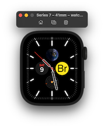
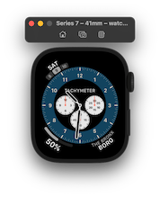

# Boro
## and BoroKit

### The App

Widget and Complications that update depending on which borough of NYC you are in.

Complications update in the background, requesting time using watchOS' `WKBackgroundRefreshTask` and  `handle()` methods.

Supported `CLKComplication` Families:

* `CLKComplicationFamily.utilitarianSmall`
* `CLKComplicationFamily.extraLarge`
* `CLKComplicationFamily.graphicCorner`
* `CLKComplicationFamily.graphicCircular`

### The Framework

* `Boro` enum type accepts a `CLPlacemark` and 

* `BoroManager` class performs and caches most recent lookup.

### TODO

* Animating main screen, indicator view.

* Additional Complication families

* SwiftPM

### Frameworks Used

`WatchKit`, `ClockKit`, `SwiftUI`, `Combine`, `CoreLocation`
